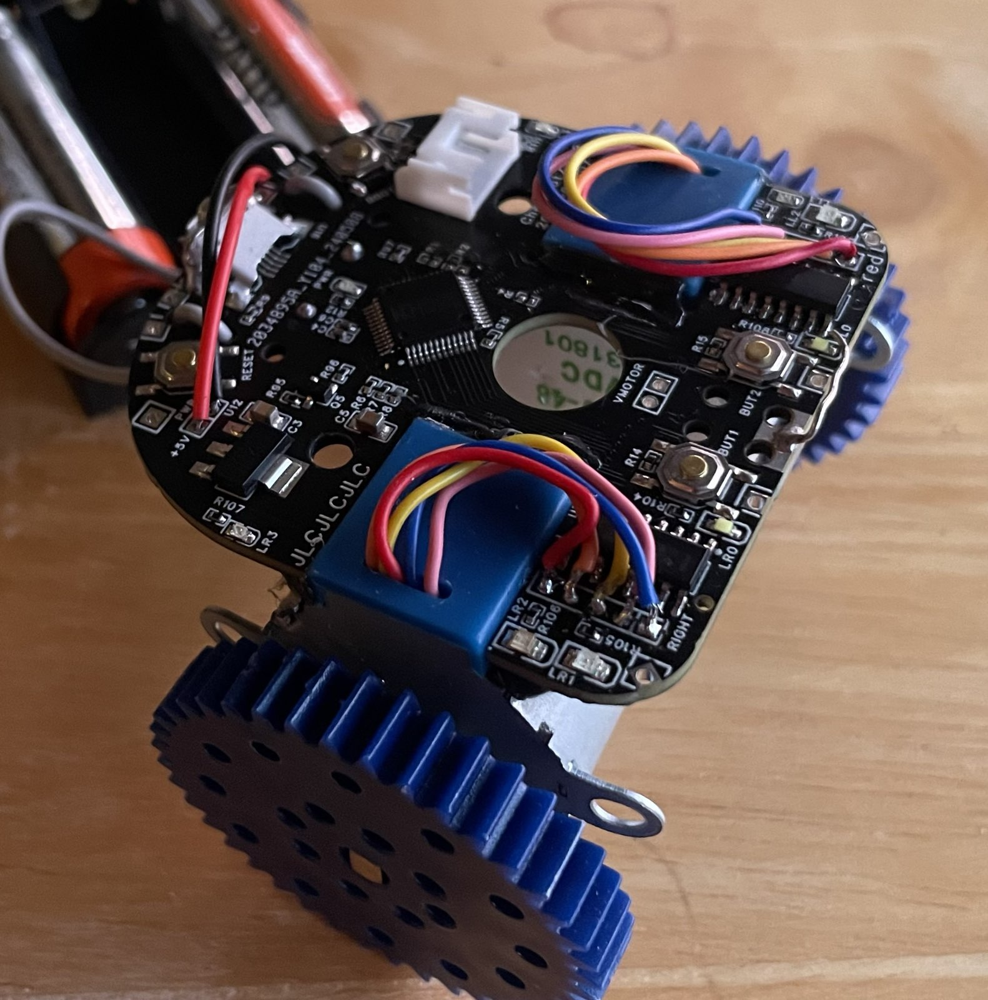
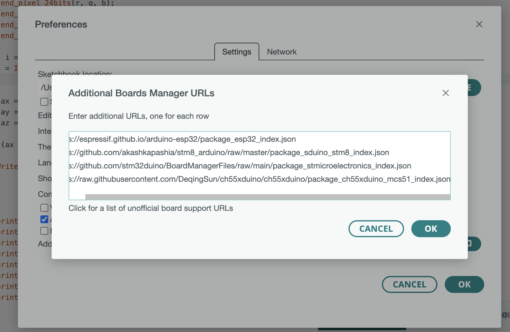
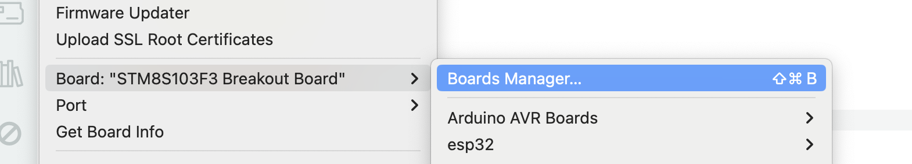
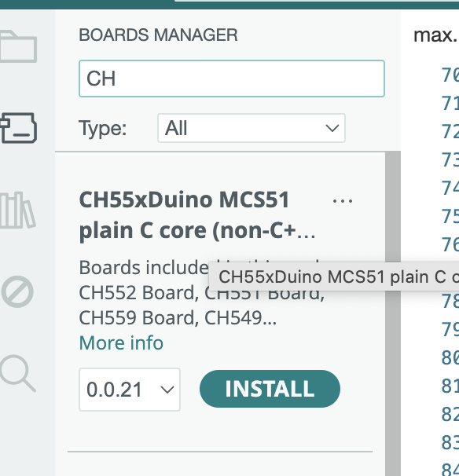
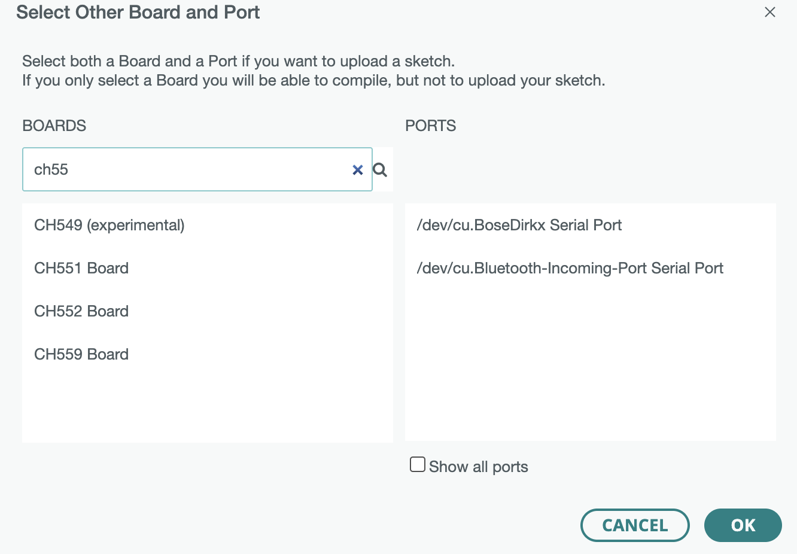
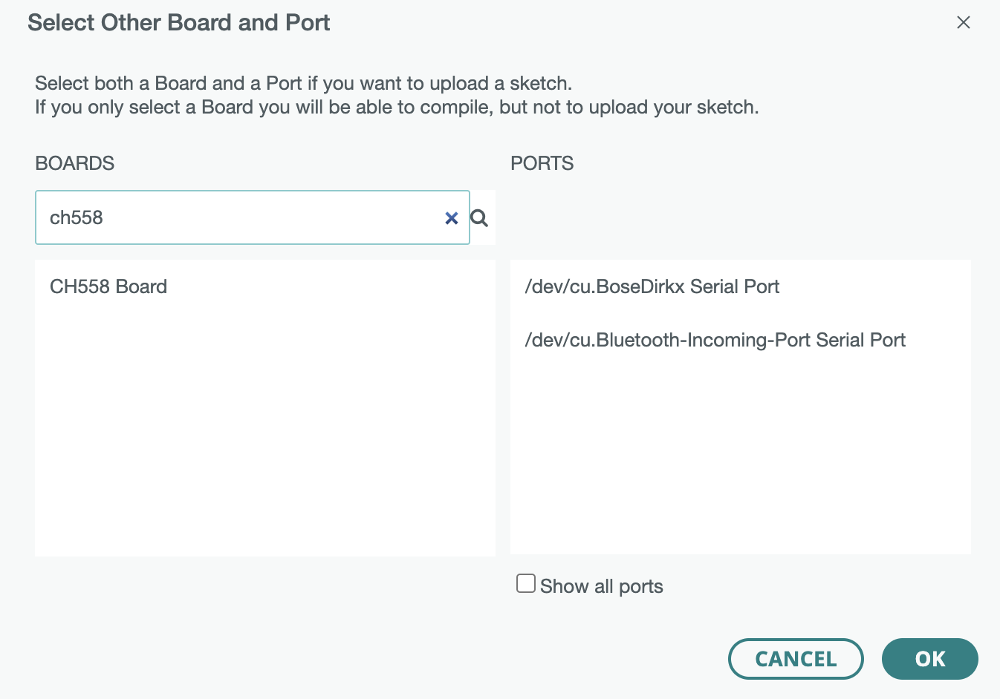
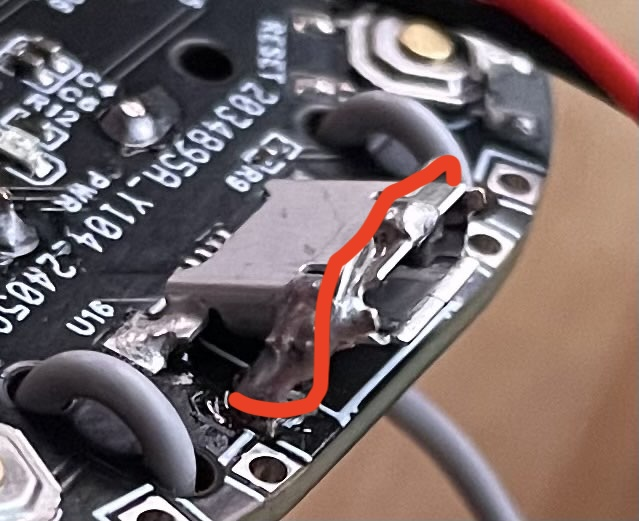
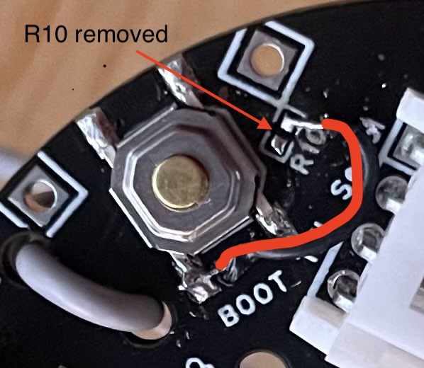
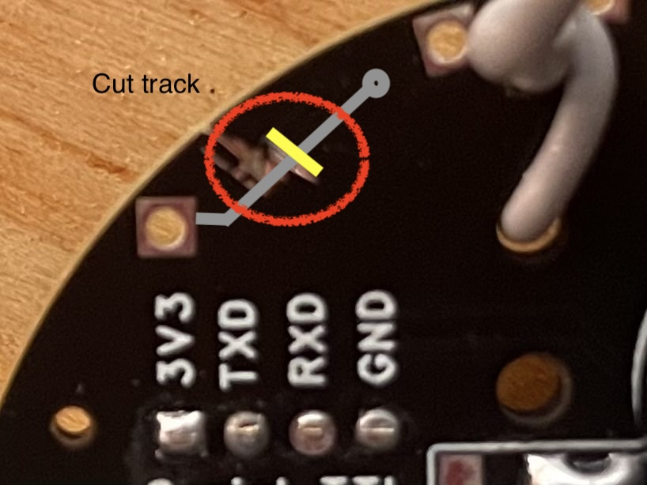

A shonkbot for less than the price of a decent pint of Bristol Beer

 * Original -- http://jarkman.co.uk/catalog/robots/shonkbot.htm
 * Board -- https://oshwlab.com/dirkx/cheapbot
 * Software -- https://github.com/dirkx/cheapbot

# Preparing board 

For 1.00 boards - apply rework #0 first.

# Arduino preparation; install 

	https://github.com/DeqingSun/ch55xduino

This is done by adding the URL

	https://raw.githubusercontent.com/DeqingSun/ch55xduino/ch55xduino/package_ch55xduino_mcs51_index.json

In the settings packages list:

Once you have done this - go to Tools and then tbe Boards, Board manager menu:

And search for the CH55x. Then install it:

.

Now search for the CH558 the 'select board' menu. If it does not appear (as shown below):

.

Then sadly the pull request https://github.com/DeqingSun/ch55xduino/pull/163 has not been installed. **ONLY** in this case do a manual install by

First checking out the cheapbot code to some location:

	git clone https://github.com/dirkx/cheapbot.git

And locate the file

	cheapbot/tools/arduino-ide-2.3.2-0.0.21.patch

in that bundle of files. Then go to the directory:

     cd ~/Library/Arduino15/packages/CH55xDuino/hardware/mcs51/0.0.21

And apply the patch with 

	cd ~/Library/Arduino15/packages/CH55xDuino/hardware/mcs51/0.0.21
	patch -p1 --dry-run < LOCATION_OF_ABOVE_GIT_CLONE/cheapbot/tools/ide-2.3.2-0.0.21.patch

It should show you

     patching file boards.txt
     patching file 'cores/ch55xduino/Arduino.h'
     ...

with no errors. If so - apply it again, but now for real:

	patch -p1 < LOCATION_OF_ABOVE_GIT_CLONE/cheapbot/tools/ide-2.3.2-0.0.21.patch

Then restart your arduino IDE. And you now should see a CH558 board:

.

# First flashing 

	Device should be in firmware modus. If not - see Rework #1 below; then
	press boot button during insertion of USB cable.

# Later flashing #

	The standard arduino firmware will put the device in boot mode if the serial
	is set to 1200 baud shortly. So Rework #1 is not needed if your first flashing
	succeeds -and- is with an Arduino build payload.

# Manaully force into firmware boot without rework #1

Start a serial tool (e.g. SerialTools), set the baudrate to 1200 and hit the connect button. All LEDs should now come on -and serial tools should no longer see the serial device (until you flash or powercycle).

# Initial bringup #

00_blink	- check if the LEDs works. Do not connect the motors yet - they will get hot.

01_motor	- motor's wired up; pining identical as on the motor connector. 

02_buttons	- solder in buzzer (if you do it earlier - you get an annoying bzz) - button presses should now work.
		  solder jumper P0.6 needs to be in place.

# Flashing

So the CH558 is shipped from the factory with a USB bootloader. When you connect it
it should show up as 4348:55e0 (WinChipHead) on your USB bus. This signals that it
is in bootloader mode and can be flashed.

Once you have flashed it (once) from the Arduino environment - it will show up as
1209:c550 as a normal serial port. And you can see your serial println statements
here. If you set it to 1200 baud (done by selecting the right USB serial device
in the Arduino IDE) then the bootloader interprets this as a requet to go back
into boot mode. It will leave the bus; and rejoin as 4348:55e0.

If it initially shows as 1209:c550 (Generic, or Arduino) or something else,  then it has 
already been flashed. In that case it needs to be brought in BOOT mode. Depending on how 
the previous flashing went - this is either by pulling DP5.1 to the 3v3 rail; or by 
connecting P4.6 to ground during powerup.

## How to see it is ready to be flashed

When the CPU is halted & ready to be flashed; all LEDs are on; the motors
are blocked and the buzzer is buzzing (owing to all GPIO's to be high). 

## It wont flash

First check if you can get it into flash mode via the 1200 baud trick. This
requires your device to show up in the list of serial USB devices.

Use any serial tool (e.g. SerialTools); and do unplug the robot; check
the pulldown tool with the available serial ports (or screenshot it), Then
connect the robot and check again. If there is an extra port - that is
the robot. In that case - set the baudrate first to 1200; and then do
'connect' from your serial console. The device should disappear as
a serial device; and all LEDs on the robot come on. You are now in 
flashing mode - try again from your Arduino IDE to flash.

## Nope - won't flash

If this is your every first time flashing; do rework #1, press the boot button
and power up the board while holding it pressed. It now should stay in boot
mode for a few seconds. As an alternative for rework #1 - you can also touch
the leftmost pad (nearest to the buzzer) of the bootselect solder-pad on the 
back with a wire to 3v3 while powering it up. There is a 3v3 on the serial
connector.

## It still wont flash

First - check that the solderpad on the back is to 'boot'.

Secondly - check in the Arduino IDE that you selected "Bootloader Pin": "PD5.1 (USB DP to 3V2)"
and not to P4.6. As that will break the Arduino Flashing `1200 baud serial' trick.

## Darn - I did select 4.6 by accident (and 1200 baud does not work)

You will need to pul PP4.6 down during powerup to GND. An easy way to do this is to
touch the leftmost pin (furthest away from Led LR2 and the board edge) of R106. There
is a convenient ground pad in the middle top of the board - between button 1 and 2.

# Board Version 1.00

The side with the CPU (big square chi) is the top side.

Hold the board with the USB connector nearest to you - and the side with Vmotor
away from you. So the USB cable becomes the 'tail'. And the two white LEDs (LR0
and LL0) become the 'headlights' at the front. 

## Rework #0 

The slot for the USB connector was not cut out properly. As a result the
USB connector is at a 45 degree angle. Secure it by soldering a U shapped
piece of stuff wire over it - thus fixing it in position. And then put some
extra solder on the rear 2 tabs. 

## Rework # 1 

This rework is not essential; provided your very first download is done
from the Arduino IDE environment; so that it has the '1200 baud' trick
to get the device into boot-state.

The BOOT switch should have been wired to 3V3; it was wired by accident
to GND. Remove R10 and cut the trace at the back of the board that runs
to the pin-header below R10. Then place a bodge wire from the
left R10 pad (i.e. away from the BOOT switch, 3V3), to the top right
pin of the BOOT switch (nearest to the USB connector). 
	

# Bill of materials

| Item | Source | Price |
|------|--------|-------|
| 3 AA batteriess | some local shop | 3.00 euro per 3 |
| PCB including parts and soldering| JLCPCB | 2.10 euro/piece at 25 units FOR |
| 2 28byj-48  Steppers | Aliexpres | 0.80-1.90 euro per pair, inc. shipping |
| 3AA Battery nest | Amazon | 0.82 euro/piece inc. shipping |
| Some stiff wire or tie-wraps |||
| A pen |||
| Bit of tape to make the pen the right thickness |||
| Some hotglue |||

## Known flaws of 1.00

 *  The connector are 2mm rather than 2.54mm spaced; so standard motors cannot use their (too long) cables and connectors. They have to be soldered in or to be given a new connector. The pitch is a bit fine for a beginner. The PCB needs to be made about 5mm bigger in every direction to accomdate this.

 * The hole in the middle is a bit small for the `thick' sharpie pent.

 * The batterynest mounting holes need a rethink; with short bolts they obscure the hole of the pen -and- the nuts are a bit fiddly `under' the motor.

 * The motor voltage is not well labeled (top missing)

 * The solder jumper for boot/0.6 is not as nice as the one for the motor; a smaller one should be selected.

 * The battery connector should be one size bigger (it is now more the size common on LiPo -- as opposed to 3 AA or 3 AAA nests).

 * Easier D4.6 pad near GND for alternative boot.

